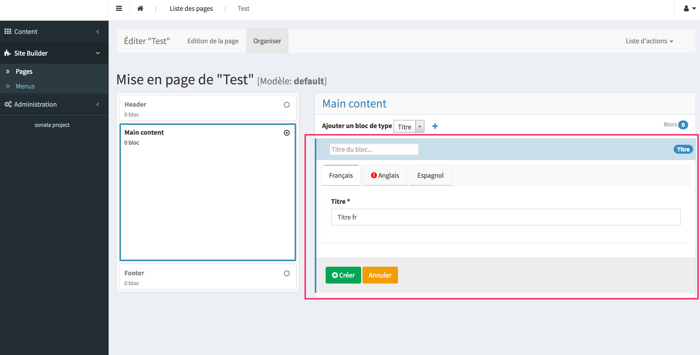

# Immutable tabs form type

To get tabs into a block of page or admin form.



## Requirements

- https://github.com/sonata-project/SonataCoreBundle

## Implementation

It extends the `Sonata\CoreBundle\Form\Type\ImmutableArrayType`

And use a specific widget defined in `src/AdminBundle/Ressources/Views/form_admin_fields.html.twig` so you must add it to your admin sonata config

```
sonata_admin:
    admin_services:
        canalplus.awaken.admin.item:
            templates:
                form: ['CanalPlusAwakenAdminBundle:Form:form_admin_fields.html.twig']
```

Don't forget to add the css `src/AdminBundle/Ressources/public/css/immutableTabsType.css` to have cute tabs

An array of tabs must be set
 key :   key of tab that will be used to record value in database
 value : label of tab that will displayed

This array must be send in the options array with the key 'tabs'

### Example of page block with an immutableTabsType

```
/**
 * Class TitleBlockService.
 */
class TitleBlockService implements BlockServiceInterface
{
    // Setting of tabs
    const TABS = [
        'fr' => 'français',
        'en' => 'anglais',
        'es' => 'espagnol',
    ];

    /**
     * {@inheritdoc}
     */
    public function configureSettings(OptionsResolver $resolver)
    {
        parent::configureSettings($resolver);

        // Add all tab keys
        foreach (self::TABS as $tabKey => $tab) {
            $resolver->setDefined($tabKey);
        }

        $resolver->setDefaults([
            'template' => 'SonataBlockBundle:Block:block_core_text.html.twig',
        ]);
    }

    /**
     * {@inheritdoc}
     */
    public function buildEditForm(FormMapper $formMapper, BlockInterface $block)
    {
        $formMapper->add('settings', ImmutableTabsType::class, [
            'keys'   => [
                ['title', TextType::class, ['label' => 'Titre']],
            ],
            'label' => false,
            'tabs'  => self::TABS,
        ]);
    }

    /**
     * {@inheritdoc}
     */
    public function validateBlock(ErrorElement $errorElement, BlockInterface $block)
    {
        foreach (self::TABS as $tabKEy => $tab) {
            $errorElement
                ->with(sprintf('settings[%s][title]', $tabKEy))
                ->addConstraint(new Length(['max' => 255]))
                ->end()
            ;
        }
    }
...
```

## Data of immutableTabsType

data are a json with the key of the immutableTabsType then the key of tabs as sub-keys

### Exemple of data

````
{
  "settings": {
    "fr": {
      "title": "Titre fr"
    },
    "en": {
      "title": "Titre en"
    },
    "es": {
      "title": "Titre es"
    }
  }
}
````