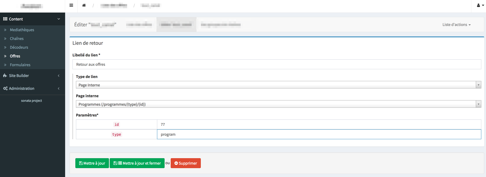

# Internal External Form Type

## For what

Form type to input an link in an admin form

You can choice a type of link :
- no link
- link to an external link
- link to an internal page of your admin. they can be filtered by current site if needed.


For no link, there nothing to do :


For an external link, only input target url :


For an internal link, first choose the internal target page among all available pages :


Then input parameters if there are some :



When admin form is loaded the link form is collpased but a button allows to open and update it. 


## How it works

InternalExternalLink form type groups many fields to record each type of values.
Javascript is used to display form and manage interaction between each field.

A specific Twig block is used to format all fields and add classes that will be used as selector by javascript :
block `sonata_type_internal_external_link_type_widget` of `src/Ressources/views/Form/form_admin_fields.html.twig`


## Installation

You must include css `src/Ressources/public/css/linkWidget.css` to your project

You must call the `src/Ressources/public/js/backoffice.js` to init InternalExternalLink form type if present in current admin

## How to implement an InternalExternalLink form type to your admin

It uses a specific widget defined in `src/Ressources/views/Form/form_admin_fields.html.twig` so you must add it to your admin sonata config

```yaml
sonata_admin:
    admin_services:
        your.admin.entity:
            templates:
                form: ['SonataHelperBundle:Form:form_admin_fields.html.twig']
```

You must inject to your admin the service `sonata.page.manager.page` with method `setPageManager`. It will be passed to InternalExternalLink form types to get internal pages. 

You can add each field of InternalExternalLink form type to your entity to save them in separated properties but it is more easy to encapsulate an 
InternalExternalLink form type in an ImmutableArrayType form type so all fields will be save in one property of your entity with a json format.

So you must add property and getter/setter to your entity.

```php
class YourEntity
{
    /**
     * @var string
     */
    protected $backLink;

    /**
     * @return array
     */
    public function getLink()
    {
        return json_decode($this->link, true);
    }

    /**
     * @param array $link This should be an array containing the following keys:
     *                     - linkType
     *                     - link
     *                     - page
     *                     - params
     *
     * @return $this
     */
    public function setLink(array $link)
    {
        $this->link = json_encode($link);

        return $this;
    }

    ...
}    
```

Then you can use an InternalExternalLink form type to your admin form by example :

```php
use Sonata\SonataHelpersBundle\Form\DataTransformer\PageDataTransformer;
use Sonata\SonataHelpersBundle\Manager\PageManagerInterface;

class YourAdmin extends AbstractAdmin
{
    /**
     * @var PageManagerInterface
     */
    private $pageManager;

    /**
     * @param PageManagerInterface $pageManager
     */
    public function setPageManager(PageManagerInterface $pageManager)
    {
        $this->pageManager = $pageManager;
    }

    ...

    /**
     * {@inheritdoc}
     */
    protected function configureFormFields(FormMapper $formMapper)
    {
        $site = $this->getSubject()->getSite(); // To filter page by the site of the current object

        $formMapper
            ->with('Lien de retour', ['class' => 'col-md-6'])
                ->add('backLabel', TextType::class, [
                    'label'    => 'Libellé du lien',
                    'required' => true,
                ])
                ->add('Link', ImmutableArrayType::class, [
                    'keys' => [
                        ['link', InternalExternalLinkType::class, ['site' => $site, 'label' => false, 'required' => false]],
                    ],
                    'label' => false,
                ])
            ->end()
    }

    ...
}
```


## Validator

You can check InternalExternalLink form type data with validator `src/Validator/Constraints/InternalExternalLinkValidator.php`.