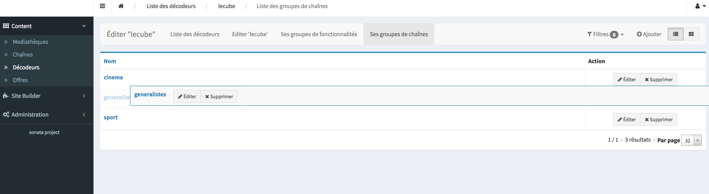

# Admin sortable list

To sort an admin list by drag&drop



## How it works

Specific templates are used by your admin to add a class to HTML table to init javascript drag&drop:
- `sonata/src/Ressources/views/CRUD/list_outer_rows_sortable_list.html.twig`
- `sonata/src/Ressources/views/CRUD/list_sortable.html.twig`

When you drop the row of your list, an ajax call send all positions of your items list to a new route of your admin to save all positions

## Installation

You must install some javascript libraries to your project :
 - `"@shopify/draggable": "^1.0.0-beta.8"`
 - `"superagent": "3.8.2"`
 
You must include css `sonata/src/Ressources/public/css/sortableAdminList.css` to your project
 
You must call the `sonata/src/Ressources/public/js/backoffice.js` to init drag&drop if a sortable list is display

## How to implement drag&drop to your admin

To use drag&drop to your entity admin, you must update your code like below

### Position field

You must add a field position to your entities

```xml
<?xml version="1.0" encoding="utf-8"?>
<doctrine-mapping xmlns="http://doctrine-project.org/schemas/orm/doctrine-mapping"
                 xmlns:xsi="http://www.w3.org/2001/XMLSchema-instance"
                 xsi:schemaLocation="http://doctrine-project.org/schemas/orm/doctrine-mapping
                 http://doctrine-project.org/schemas/orm/doctrine-mapping.xsd">

    <entity name="AppBundle\Entity\YourEntity" table="your_entity_table">
        <id name="id" type="integer" column="id">
            <generator strategy="AUTO"/>
        </id>

        <field name="position" type="integer" column="position" nullable="true"/>
        ...

    </entity>
</doctrine-mapping>
```

And use the trait `Sonata\HelpersBundle\SortableListAdmin\PositionableEntityTrait` to your entity to add the field position and getter/setter

```php
use SortableListAdmin/PositionableEntityTrait.php

class YourEntity
{
    use PositionableEntityTrait;

    ...
}
```

### Admin 

To use drag&drop to an admin list, there must be some restrictions :
- list is the only mode, you must disable mosaic button
- your list must be only sorted by position asc
- your list must display all objects in a single page
- your admin must have a new route `save_positions`
- you admin must use specific twig templates
- a new object will be saved with a position

You must set a Registry to your admin :
```xml
    <!-- admin.xml -->
    <service id="admin.your_entity" class="YourEntityAdminPath">
        <tag name="sonata.admin" manager_type="orm" label="Your entity admin" show_mosaic_button="false"/> <!-- disable mosaic button -->

        <argument />
        <argument>YourEntityPath</argument>
        <argument>YourEntityAdminControllerPath</argument> <!-- specific controller -->

        <call method="setRegistry">  <!-- to get the last position to create new entity with position -->
            <argument type="service" id="doctrine"/>
        </call>
    </service>
```

You can extend your admin with `Sonata\HelpersBundle\SortableListAdmin\AbstractSortableListAdmin`.
This abstract class provides some configurations to get only one page and methods to set a registry, add a route `save_positions`, set specific twig templates and add a position before persist an entity

But your list fields must not be sortable, so you must update your admin :

```php
class YourEntityAdmin extends AbstractAdmin
{
    ...
    
    /**
     * {@inheritdoc}
     */
    protected function configureListFields(ListMapper $listMapper)
    {
        $listMapper
            ->addIdentifier('name', TextType::class, [
                'label'    => 'Nom',
                'sortable' => false,   // List no sortable
            ])
        ;
    }

    ...
}
```

And you must update `AbstractAdmin` with the name of your bundle
```php
abstract class AbstractSortableListAdmin extends AbstractAdmin
{
    ...
    public function getTemplate($name)
    {
        switch ($name) {
            // @Todo : update twig path with your bundle
            //case 'list':
            //    return 'YourBundle:CRUD:list_sortable.html.twig';
            //case 'outer_sortable_list_rows_list':
            //    return 'YourBundle:CRUD:list_outer_rows_sortable_list.html.twig';
            default:
                return parent::getTemplate($name);
        }
    }
    ...
```

### Admin controller

A new action `savePositionsAction` for the route `save_positions` that will save new positions of all objects
This action use the service `admin.sort_action` that will update field `position` in database

You must use trait `Sonata\HelpersBundle\SortAction\SortActionAdminControllerTrait` to your admin controller to add the action method


```php
use SortAction/SortActionAdminControllerTrait.php

class YourEntityAdminController extends Controller
{
    use SortActionAdminControllerTrait;

    ...
}
```

### `admin.sort_action` service

`/sonata/src/SortAction/SortAction.php`

This service is used by `Sonata\HelpersBundle\SortAction\SortActionAdminControllerTrait` to save positions of items.

You must add a your sortable class to define it database table and it sort field
```php
class SortAction
{
    // Sortable class names and their database table name and sort field
    const SORTABLE_CLASS = [
        YourEntity::class => [
            'table' => 'your_entity_table',
            'field' => 'position',
        ],
    ];
    ...
```
