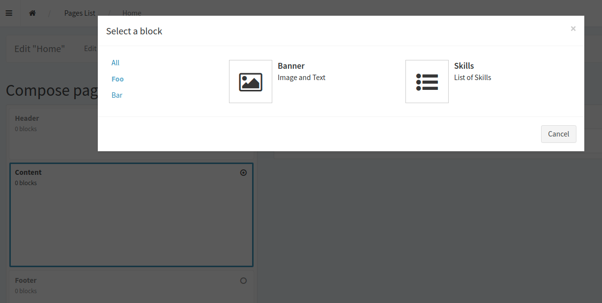

# Block selection dialog with categories



## Configuration

To enable and configure this dialog (replacing the default dropdown and button) you have to configure it according to the following example:

```
sonata_helpers:
  compose_container:
    enabled: true
    categories:
      '':  "block.category.default"
      foo: "Foo"
      bar: "Bar"
    block_config:
      'App\Block\BannerBlockService':
        categories:
          - foo
      'App\Block\SimpleTextBlockService':
        only_pages:
          - home
        categories:
          - bar
      'App\Block\SkillsBlockService':
        categories:
          - foo
          - bar
```

* `enabled`: Set to `false` to completely disable the feature. (Or do not add this configuration at all.)
* `categories`: Key-label-list of all available categories. The empty key is the default category, assigned to all blocks without specified categories.
* `block_config`: Assign one or more categories to each Block class.
* `categories`: List of all categories (keys) in which the block should appear.
* `only_pages`: Can be added to restrict a block to certain routes.

**Important:** If this features is enabled, the `PageAdminController` will be replaced by this bundle's version to override `composeContainerShowAction()`. If you need to extend it, please extend `Sonata\HelpersBundle\Controller\PageAdminController`.


## Installation

This feature requires jQuery 2 or 3.

You need to make the following files available to the web frontend:
* `src/Resources/public/js/MutationObserver.js`
* `src/Resources/public/css/blockSelectModal.scss`


If for example you use Webpack-Encore, edit your `webpack.config.js`:

```
Encore.addStyleEntry('...', [
  ...
  path.resolve('/vendor/ekino/sonata/src/Resources/public/css/blockSelectModal.scss')
]);
...
Encore.addEntry('...', [
  ...
  path.resolve('/vendor/ekino/sonata/src/Resources/public/js/MutationObserver.js')
]);
```

