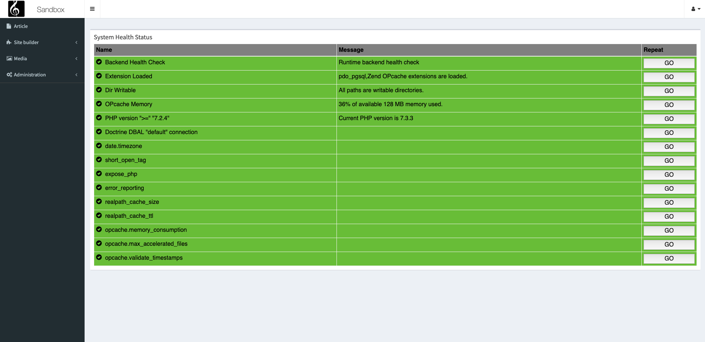

# Provide an interface for Liip Monitor



## Configuration

Add the following configuration to your sonata_admin.yaml under the blocks section.

```
blocks:
    - position: top
      class: col-md-12
      type: 'Sonata\HelpersBundle\Block\Dashboard\MonitorBlockService'
```

Add also the new block into sonata_block.yaml under the blocks section:

```
blocks:
    # App Dashboard Blocks;
    'Sonata\HelpersBundle\Block\Dashboard\MonitorBlockService':
        contexts: [admin]
```

Your services.yaml file should look like:

```
services:
    # default configuration
    _defaults:
        ...
        bind:
            ...
            $liipMonitorDefaultGroup: '%liip_monitor.default_group%'

    # Sonata Liip Monitor Block
    'Sonata\HelpersBundle\Block\Dashboard\MonitorBlockService':
        arguments:
            $name: 'System Health Status'
            $pathHelper: '@liip_monitor.helper'
```

You will have to add some resources to your webpack config:

First define the path to ekino vendor bundle, for example:

```
const ekinoPrefix = path.resolve(__dirname,'./vendor/ekino/');
```

Then, use it to add the needed style and javascript:

```
const Encore = require('@symfony/webpack-encore');

...

Encore
    .setOutputPath('public/assets/admin')
    .setPublicPath('/assets/admin')
    .addStyleEntry('sonata-styles', [
        ...
        path.resolve(ekinoPrefix, 'sonata/src/Resources/public/css/liipMonitor.scss'),
    ])
    .addEntry('admin', [
        ...
        path.resolve(ekinoPrefix, 'sonata/src/Resources/public/js/HealthCheck.js'),
    ])
```


